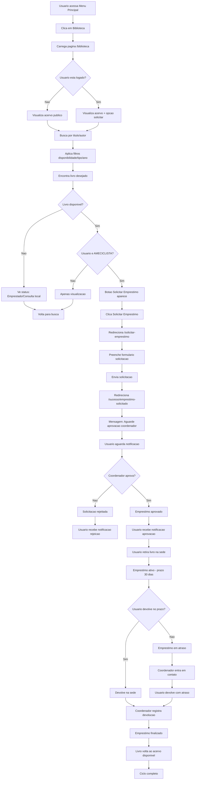
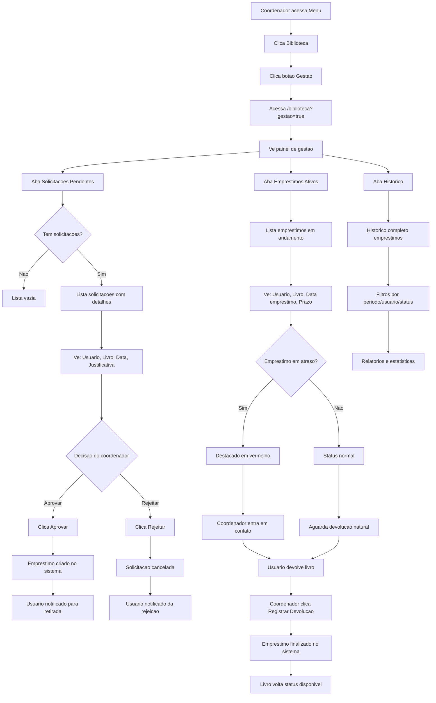
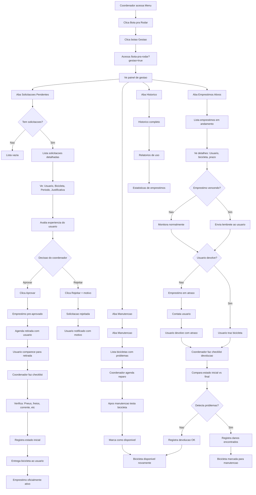

# Ciclos Completos do Usuário - Biblioteca e Bota pra Rodar

Este documento mapeia os ciclos completos de interação dos usuários nos sistemas de Biblioteca e Bota pra Rodar, desde o acesso inicial até a conclusão do empréstimo.

## 📚 Ciclo Completo - Sistema de Biblioteca

### 🔄 Fluxo do Usuário Comum (Empréstimo)

### 🔧 Fluxo do Coordenador (Gestão)

## 🚴 Ciclo Completo - Sistema Bota pra Rodar

### 🔄 Fluxo do Usuário Comum (Empréstimo de Bicicleta)

```mermaid
flowchart TD
    A[Usuario acessa Menu Principal] --> B[Clica em Bota pra Rodar]
    B --> C[Carrega pagina /bota-pra-rodar]
    C --> D{Usuario esta logado?}
    
    D -->|Nao| E[Visualiza bicicletas publico]
    D -->|Sim| F[Visualiza bicicletas + opcao solicitar]
    
    E --> G[Busca por nome/codigo]
    F --> G
    G --> H[Aplica filtros disponibilidade/tipo]
    H --> I[Encontra bicicleta desejada]
    
    I --> J{Bicicleta disponivel?}
    J -->|Nao| K[Ve status: Emprestada]
    J -->|Sim| L{Usuario e AMECICLISTA?}
    
    K --> M[Volta para busca]
    L -->|Nao| N[Apenas visualizacao]
    L -->|Sim| O[Botao Solicitar Emprestimo aparece]
    
    N --> M
    O --> P[Clica Solicitar Emprestimo]
    P --> Q[Redireciona /solicitar-emprestimo-bicicleta]
    Q --> R[Preenche formulario detalhado]
    
    R --> S[Informa: Periodo, Justificativa, Experiencia]
    S --> T[Envia solicitacao]
    T --> U[Redireciona /sucesso/emprestimo-bicicleta-solicitado]
    U --> V[Mensagem: Aguarde aprovacao coordenador]
    
    V --> W[Usuario aguarda notificacao]
    W --> X{Coordenador aprova?}
    X -->|Nao| Y[Solicitacao rejeitada]
    X -->|Sim| Z[Emprestimo aprovado]
    
    Y --> AA[Usuario recebe notificacao rejeicao]
    Z --> BB[Usuario recebe notificacao aprovacao]
    BB --> CC[Agendamento para retirada]
    CC --> DD[Usuario retira bicicleta na sede]
    
    DD --> EE[Coordenador faz checklist bicicleta]
    EE --> FF[Registra condicoes iniciais]
    FF --> GG[Emprestimo ativo - prazo acordado]
    
    GG --> HH{Usuario devolve no prazo?}
    HH -->|Sim| II[Devolve na sede]
    HH -->|Nao| JJ[Emprestimo em atraso]
    
    II --> KK[Coordenador faz checklist devolucao]
    JJ --> LL[Coordenador entra em contato]
    LL --> MM[Usuario devolve com atraso]
    MM --> KK
    
    KK --> NN{Bicicleta em bom estado?}
    NN -->|Sim| OO[Registra devolucao normal]
    NN -->|Nao| PP[Registra danos/manutencao]
    
    OO --> QQ[Bicicleta volta ao acervo]
    PP --> RR[Bicicleta vai para manutencao]
    RR --> SS[Apos reparo volta ao acervo]
    
    QQ --> TT[Ciclo completo]
    SS --> TT
```

### 🔧 Fluxo do Coordenador (Gestão de Bicicletas)

## 📊 Comparação dos Ciclos

| Aspecto | Biblioteca | Bota pra Rodar |
|---------|------------|-----------------|
| **Complexidade** | Média | Alta |
| **Checklist Físico** | Não | Sim (retirada + devolução) |
| **Prazo Padrão** | 30 dias | Variável (acordado) |
| **Manutenção** | Não aplicável | Essencial |
| **Agendamento** | Não | Sim (retirada) |
| **Estado do Item** | Não verificado | Verificado sempre |
| **Notificações** | Básicas | Detalhadas |
| **Aprovação** | Simples | Criteriosa |

## 🔄 Pontos de Integração

### 📱 Notificações do Sistema
- Aprovação/rejeição de solicitações
- Lembretes de vencimento
- Confirmações de devolução

### 👥 Interação Coordenador-Usuário
- Comunicação via Telegram
- Agendamentos presenciais
- Orientações de uso

### 📈 Dados Gerados
- Estatísticas de uso
- Relatórios de empréstimos
- Histórico de manutenções (bicicletas)

Este mapeamento mostra como cada sistema tem suas particularidades, sendo o Bota pra Rodar mais complexo devido à natureza física e valor dos itens emprestados.