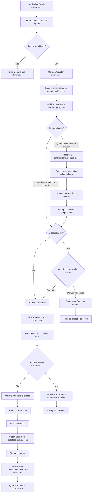
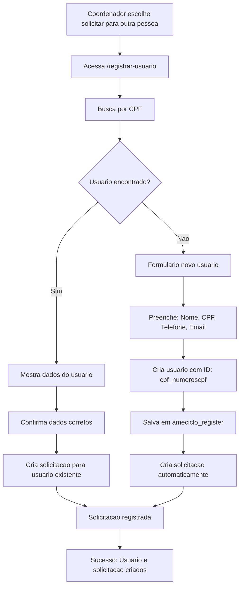
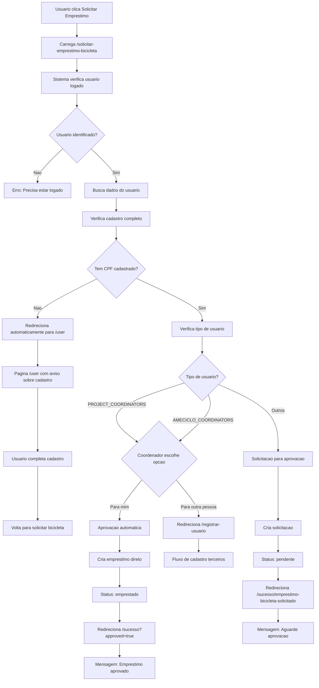

# Fluxo Detalhado - Solicitação de Empréstimo

Este documento detalha o processo real de solicitação de empréstimo baseado no código implementado, mostrando as diferenças entre tipos de usuário e validações necessárias.

## 📚 Fluxo Detalhado - Biblioteca

### 🔄 Processo Completo de Solicitação



### 🔧 Fluxo do Coordenador para Terceiros



## 🚴 Fluxo Detalhado - Bota pra Rodar

### 🔄 Processo Completo de Solicitação



### 🔧 Fluxo do Coordenador para Terceiros


## 🔐 Matriz de Permissões e Validações

| Tipo de Usuário | Biblioteca | Bota pra Rodar | Cadastro Obrigatório | Aprovação |
|------------------|------------|-----------------|---------------------|-----------|
| **ANY_USER** | ✅ Com cadastro | ✅ Com cadastro | ✅ Sim | Manual |
| **AMECICLISTAS** | ✅ Com cadastro | ✅ Com cadastro | ✅ Sim | Manual |
| **PROJECT_COORDINATORS** | ✅ Com cadastro | ✅ Com cadastro | ✅ Sim | Automática (bicicletas) |
| **AMECICLO_COORDINATORS** | ✅ Com cadastro | ✅ Com cadastro | ✅ Sim | Automática (bicicletas) |

## 📋 Validações por Sistema

### 📚 Biblioteca
```javascript
// Verificações no código
const needsLibraryRegister = user && !hasLibraryRegister && 
  (userRole === 'ANY_USER' || userRole === 'AMECICLISTAS');

const isCoordinator = userRole === 'PROJECT_COORDINATORS' || 
  userRole === 'AMECICLO_COORDINATORS';

const actuallyNeedsRegister = needsLibraryRegister && !isCoordinator;
```

### 🚴 Bota pra Rodar
```javascript
// Verificações no código
const userData = getUserData();
const needsRegister = !userData || userData.cpf === 'Não informado';

const isCoordinator = isAuth(userPermissions, UserCategory.PROJECT_COORDINATORS);
```

## 🔄 Estados da Solicitação

### 📚 Biblioteca
1. **pendente** → Aguardando aprovação do coordenador
2. **aprovado** → Coordenador aprovou, usuário pode retirar
3. **emprestado** → Livro foi retirado
4. **devolvido** → Livro foi devolvido
5. **rejeitado** → Coordenador rejeitou a solicitação

### 🚴 Bota pra Rodar
1. **pendente** → Aguardando aprovação (usuários comuns)
2. **emprestado** → Aprovado automaticamente (coordenadores)
3. **devolvido** → Bicicleta foi devolvida
4. **rejeitado** → Coordenador rejeitou

## 📊 Diferenças Principais

| Aspecto | Biblioteca | Bota pra Rodar |
|---------|------------|----------------|
| **Cadastro** | Obrigatório para todos | Obrigatório para todos |
| **Aprovação Coordenador** | Manual sempre | Automática para coordenadores |
| **Validação CPF** | Flexível | Obrigatória |
| **Solicitação Terceiros** | Via registrar-usuario | Via registrar-usuario |
| **Exemplares** | Filtra .1 (consulta local) | Não aplicável |

## 🚨 Pontos Críticos de Validação

### 1. **Identificação do Usuário**
- Telegram ID obrigatório
- Fallback para modo desenvolvimento

### 2. **Cadastro Completo**
- **TODOS os usuários**: obrigatório (CPF, email, telefone)
- **Simplificação**: Redirecionamento automático para `/user`

### 3. **Disponibilidade do Item**
- Biblioteca: verifica exemplares não .1
- Bicicleta: verifica disponibilidade geral

### 4. **Permissões Especiais**
- Coordenadores têm aprovação automática (apenas bicicletas)
- Coordenadores podem escolher "para mim" ou "para outra pessoa"
- Fluxo de terceiros via `/registrar-usuario`

### 5. **Fluxo Simplificado**
- Usuário comum: sempre redireciona para `/user` se cadastro incompleto
- Coordenadores: usam rota específica para terceiros
- Menos passos e opções confusas

Este fluxo detalhado mostra que o sistema tem validações robustas baseadas no tipo de usuário e no completude do cadastro, com tratamentos especiais para coordenadores que podem tanto ter aprovação automática quanto solicitar para outras pessoas.