# Mapeamento Completo das Rotas de Interação dos Usuários - Ameciclobot

Este documento mapeia todas as rotas e interações possíveis dos usuários no sistema Ameciclobot, organizadas por fluxo de navegação.

## 🏠 Menu Principal (/)

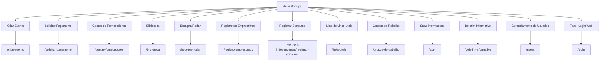

## 📚 Sistema de Biblioteca

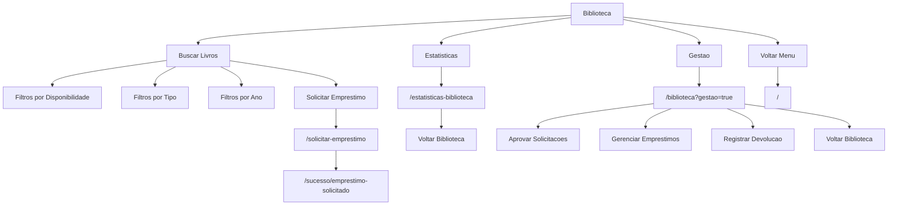

## 🚴 Bota pra Rodar

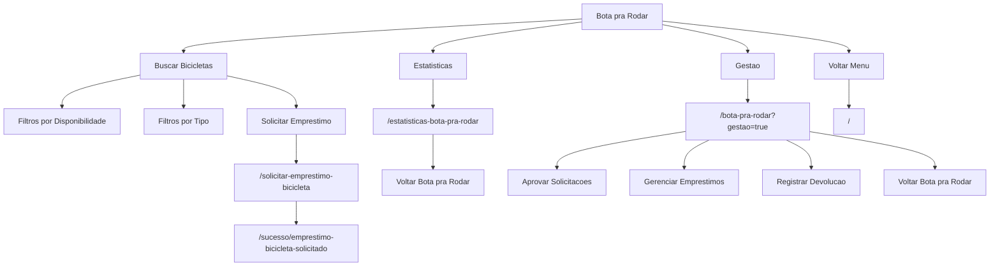

## 📦 Registro de Empréstimos (Inventário)

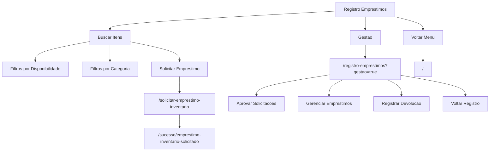

## 🛒 Recursos Independentes

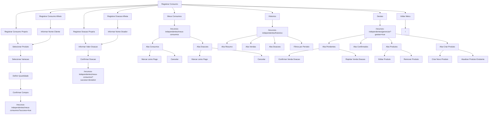

## ⚙️ Informações do Usuário

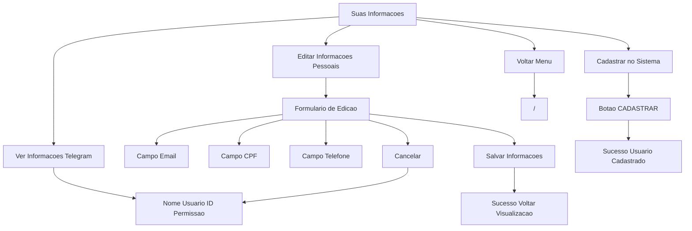

## 🔑 Sistema de Login Web

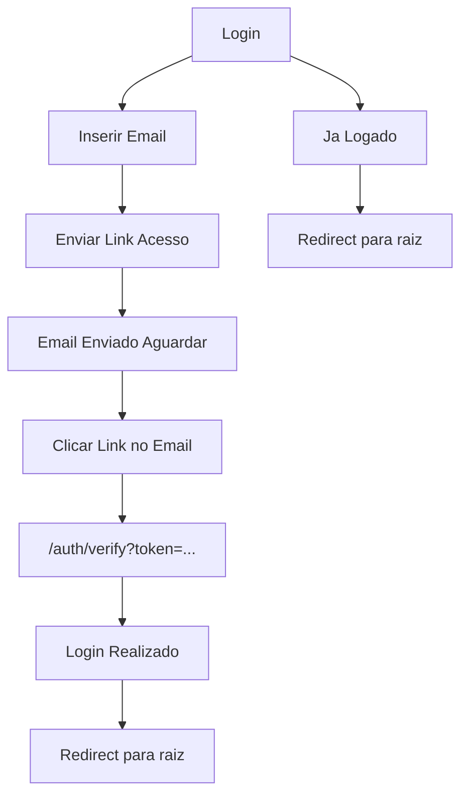

## 🔗 Links Úteis

```mermaid
graph TD
    A[Links Uteis] --> B[Site da Ameciclo]
    A --> C[Plataforma de Dados]
    A --> D[Biciclopedia]
    A --> E[Drive da Ameciclo]
    A --> F[Ver pautas para RO]
    A --> G[Acompanhar nossos gastos]
    A --> H[Ocupar a sede]
    A --> I[Requisitar equipamento]
    A --> J[Eventos Internos]
    A --> K[Eventos Externos]
    A --> L[Organizacional]
    A --> M[Divulgacao de eventos]
    A --> N[Voltar Menu]
    
    B --> B1["https://ameciclo.org"]
    C --> C1["http://dados.ameciclo.org/"]
    D --> D1["http://biciclopedia.ameciclo.org/"]
    E --> E1["http://drive.ameciclo.org/"]
    F --> F1["http://pautas.ameciclo.org/"]
    G --> G1["http://transparencia.ameciclo.org/"]
    H --> H1["http://ocupe.ameciclo.org/"]
    I --> I1["http://equipamento.ameciclo.org/"]
    J --> J1["http://internos.ameciclo.org/"]
    K --> K1["http://externos.ameciclo.org/"]
    L --> L1["http://organizacional.ameciclo.org/"]
    M --> M1["http://divulgacao.ameciclo.org/"]
    
    N --> N1["/"]
```

## 📊 Estatísticas da Biblioteca

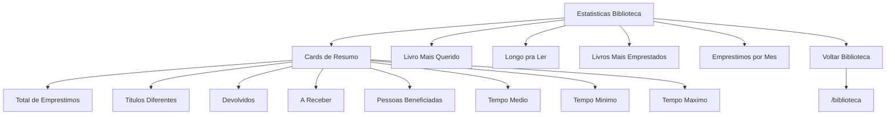

## 📧 Boletim Informativo (Coordenadores)

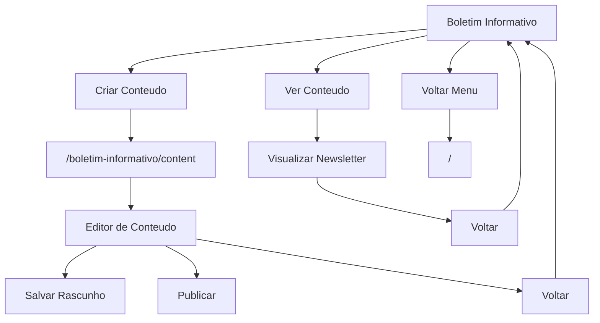

## 🔧 Gerenciamento de Usuários (Coordenadores)

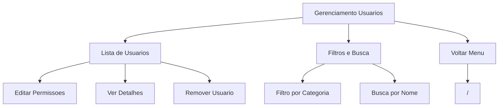

## 💰 Gestão Financeira

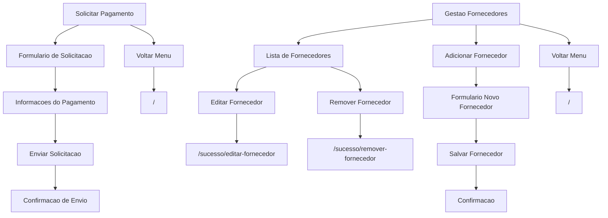

## 📅 Criar Evento

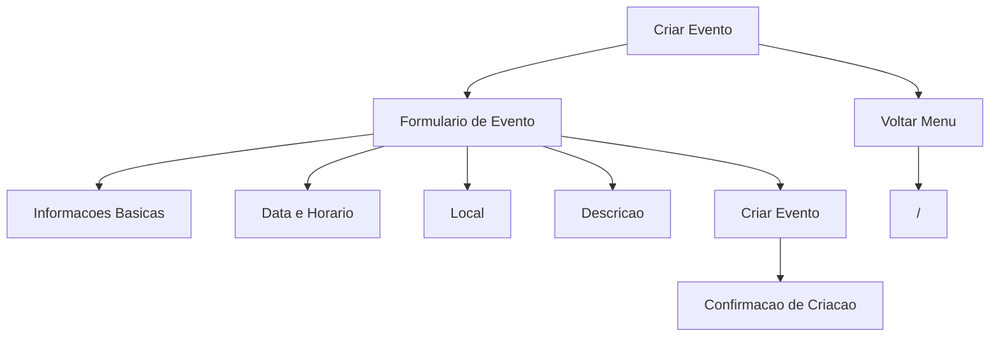

## 👥 Grupos de Trabalho

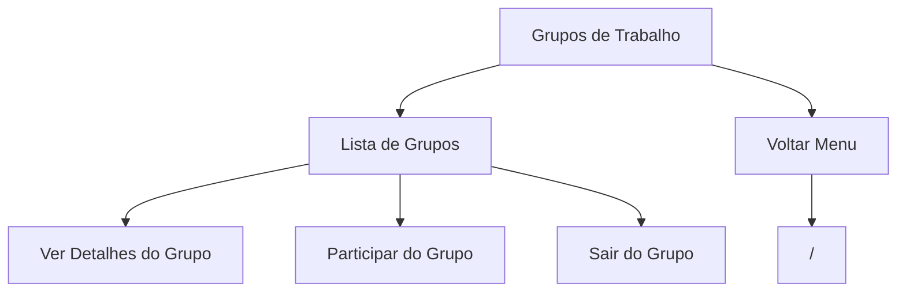

## 🚫 Páginas de Erro e Sucesso

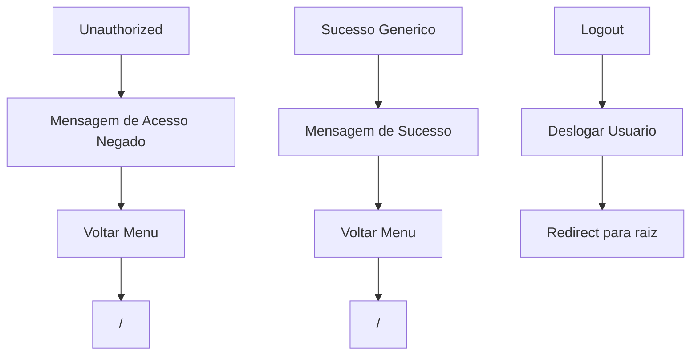

## 🔐 Controle de Permissões por Rota

| Rota | Permissão Mínima | Observações |
|------|------------------|-------------|
| `/` | ANY_USER | Menu principal |
| `/biblioteca` | ANY_USER | Acesso público ao acervo |
| `/biblioteca?gestao=true` | PROJECT_COORDINATORS | Gestão de empréstimos |
| `/bota-pra-rodar` | ANY_USER | Visualização pública |
| `/bota-pra-rodar?gestao=true` | PROJECT_COORDINATORS | Gestão de bicicletas |
| `/registro-emprestimos` | AMECICLISTAS | Acesso ao inventário |
| `/registro-emprestimos?gestao=true` | PROJECT_COORDINATORS | Gestão do inventário |
| `/recursos-independentes/*` | AMECICLISTAS | Sistema de vendas |
| `/recursos-independentes/gerenciar` | PROJECT_COORDINATORS | Gestão de vendas |
| `/user` | ANY_USER | Informações pessoais |
| `/login` | ANY_USER | Login web |
| `/links-uteis` | ANY_USER | Links públicos e internos |
| `/criar-evento` | AMECICLISTAS | Criação de eventos |
| `/solicitar-pagamento` | PROJECT_COORDINATORS | Solicitações financeiras |
| `/gestao-fornecedores` | PROJECT_COORDINATORS | Gestão de fornecedores |
| `/boletim-informativo` | AMECICLO_COORDINATORS | Newsletter |
| `/users` | AMECICLO_COORDINATORS | Gestão de usuários |
| `/grupos-de-trabalho` | AMECICLISTAS | Grupos internos |
| `/estatisticas-*` | ANY_USER | Estatísticas públicas |

## 🔄 Fluxos de Navegação Principais

### 1. Usuário Visitante (ANY_USER)
```
Menu → Biblioteca → Buscar/Filtrar → Visualizar Livros
Menu → Bota pra Rodar → Visualizar Bicicletas  
Menu → Links Úteis → Acessar Links Externos
Menu → Suas Informações → Ver/Editar Dados
Menu → Login → Autenticar via Email
```

### 2. Ameciclista (AMECICLISTAS)
```
Menu → Biblioteca → Solicitar Empréstimo → Sucesso
Menu → Registro Empréstimos → Solicitar Item → Sucesso
Menu → Recursos Independentes → Registrar Consumo → Meus Consumos
Menu → Criar Evento → Formulário → Confirmação
Menu → Grupos de Trabalho → Participar
```

### 3. Coordenador de Projeto (PROJECT_COORDINATORS)
```
Menu → Biblioteca → Gestão → Aprovar/Gerenciar Empréstimos
Menu → Recursos Independentes → Gestão → Confirmar Vendas/Doações
Menu → Solicitar Pagamento → Formulário → Envio
Menu → Gestão Fornecedores → CRUD Fornecedores
```

### 4. Coordenador Ameciclo (AMECICLO_COORDINATORS)
```
Menu → Boletim Informativo → Criar/Editar Newsletter
Menu → Gerenciamento Usuários → Gerenciar Permissões
Menu → [Todas as funcionalidades anteriores]
```

## 📱 Considerações de Interface

- **Telegram Web App**: Interface otimizada para Telegram
- **Web Browser**: Interface completa com login por email
- **Modo Desenvolvimento**: Simulação de usuários e permissões
- **Responsividade**: Adaptação para mobile e desktop
- **Navegação**: Botões "Voltar" em todas as páginas
- **Feedback**: Mensagens de sucesso/erro após ações
- **Filtros**: Busca e filtros em listagens extensas
- **Paginação**: Para grandes volumes de dados

Este mapeamento representa o estado atual do sistema e pode ser usado como referência para desenvolvimento, testes e documentação de novas funcionalidades.